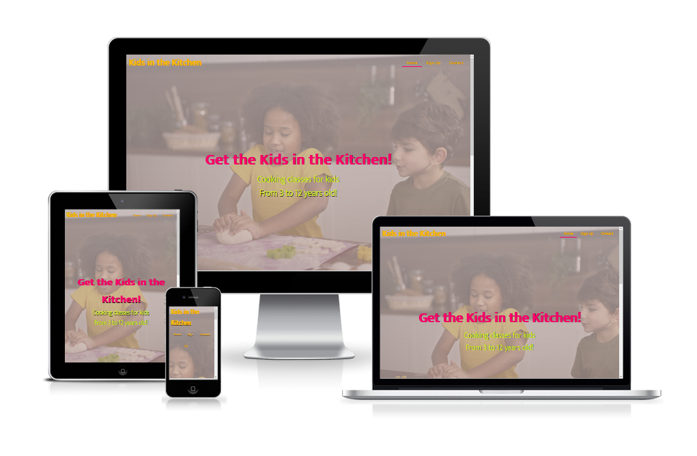
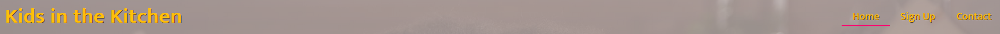
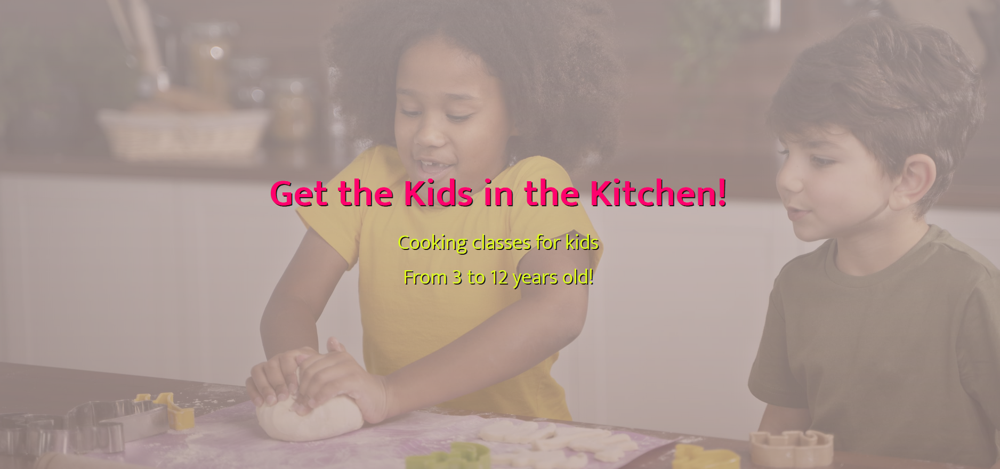
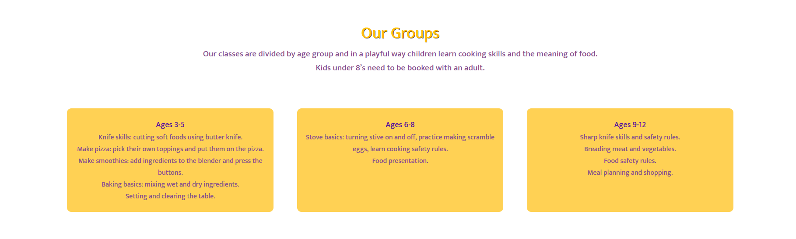
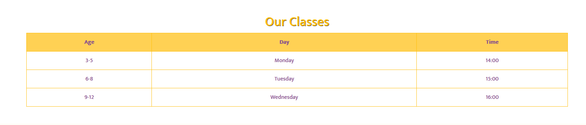
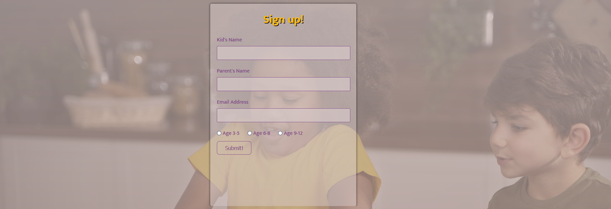
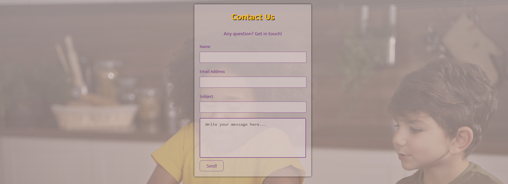
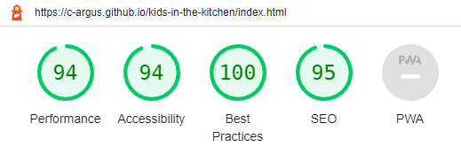
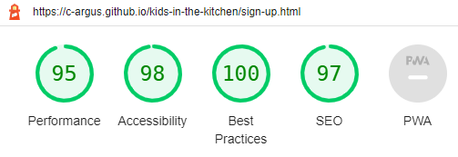
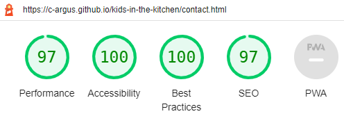

# Kids in the Kitchen

Kids in the Kitchen is a site that encourages parents to introduce their kids to the magical world of the kitchen. It provides cooking classes for kids from 3 to 12 years old in a fun and engaging environment. This way is possible to teach the kid a new skill and make a stronger bond between kids and parents.

## **Features**

### **Existing Features**

* Navigation Bar
  - Featured on all three pages, the full responsive navigation bar shows the site name in the left corner: Kids in the Kitchen that links to the top of the page.
  - It also includes links to the Home page, Sign Up and Contact page and is consistent in each page to allow for easy navigation.
  - This section will allow the user to easily navigate from page to page across all devices without having to revert back to the previous page via the ‘back’ button.
  - The current page is underligned in a color that contrasts with the background. Giving clarity of current location within thw website. There is also an active selector in bright pink to aid in navigation.

* Header Home Page
  - The header in the Home Page shows a big text in bright pink color inviting the users for a cooking class.
  - The second line gives the information about the age range for students.
  - It has a background of two kids making cookies as an inspiration for future pupils.

* The Our Groups Section
  - The Our Groups section provides a detailed description of what you can expect of each class for the three different age groups.
  - It also informs the users that some kids will need parental supervision during the classes. This should encourage kids and parents to spend some fun time toghether.

* The Our Classes Section
  - This section shows the user important information about the week day and time each age group class is offered.
  - This section will be updated as these times change to keep the user up to date.

* The Footer
  - The footer section aim the interaction of the users with Kids in the Kitchen social media.
  - Includes icons of Youtube, Twitter, Facebook and Instagram. To allow easy navigation for the user, all links open to a new tab.

* Sign Up Page
  - The Sign Up page has a form so the user can sign up for the cooking class.
  - It collects information such as the kid's name, parent's name, email for contact. The user also will specify the age group of the kid.
  - The Sign Up form is valuable to the user as it provides an easy and quick way to joing the Kids in the Kitchen cooking classes.

* Contac Us Page
  - The Contac Us Page provides a form for the user to fill in case of any information needed.
  - The interface is similar to an email structure. This way is possible to any user fill in the form without any trouble.

## Features Left to Implement

* Navigation Bar
  - This section will be updated in the future with a fixed bar for web browsers.

* Contact Us Page
  - This section will be updated with phone number and address information and Google Maps link in the future.

## Testing

* Navigation Bar
  - When the logo "Kids in the Kitchen" is clicked, it bring the user to the Home Page. This has been tested on both desktop and mobile and from all pages.
  - All links are working and have been tested.
  - The navigation bar stays at the top of the page on all screen sizes.

* Footer
  - Footer is always located at the bottom of the page regardless of the content amount. This was tested by removing all content from any given page.
  - The social links, when clicked, open the relevant social media page in a new tab.
  - All external links were tested to make sure they open up the correct pages in new tab.

* Internal Links
  - All internal links were tested to make sure that all pages are correctly connected.
  - Navigations links brings the user to the relevant pages.
  - The logo "Kids in the Kitchen" always brings the user to the home page.

* Forms
  - All the forms were tested and works perfectly, it requires entries in every field, will only accept an email in the email field, and the submit button works.

### CSS3 validator - Pass
[Results](https://jigsaw.w3.org/css-validator/validator?uri=https%3A%2F%2Fc-argus.github.io%2Fkids-in-the-kitchen%2Findex.html&profile=css3svg&usermedium=all&warning=1&vextwarning=&lang=en)

### HTML5 validator

* Home Page - **Pass** - [Results](https://validator.w3.org/nu/?doc=https%3A%2F%2Fc-argus.github.io%2Fkids-in-the-kitchen%2Findex.html)

* Sign Up Page - **Pass** - [Results](https://validator.w3.org/nu/?doc=https%3A%2F%2Fc-argus.github.io%2Fkids-in-the-kitchen%2Fsign-up.html)

* Contact Page - **Pass** - [Results](https://validator.w3.org/nu/?doc=https%3A%2F%2Fc-argus.github.io%2Fkids-in-the-kitchen%2Fcontact.html)

### Usability Testing

* To test navigation and responsive tools, the website was shared with friends and family of different ages and different levels of computer/smart device knowledge. There were no issues idenfied regarding the simplicity of navigating the website.
* The testers also verified that all buttons and links works as expected.

### Compatibility Testing

* The website was tested for responsiveness on Chrome DevTools. Different viewport sizes were simulated ranging from as small as iPhone 5 (320px) to large desktop sizes (1200px and above).

* Browser Compatibility
  - The website was tested and works as expected in different browsers, such as Firefox, Chrome, Brave and Safari.

### Accessibility Testing

* The colours and fonts chosen for each page are easy to read and accessible by running it though lighthouse in DevTools.

  - *Home Page*

  

  - *Sign Up Page*

  

  - *Contact Us Page*

  

## Deployment

